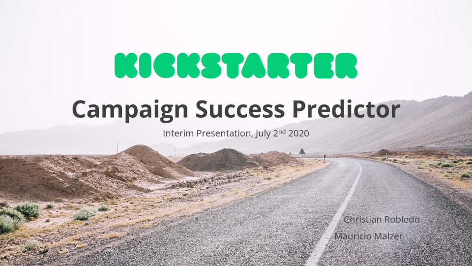

# Description
Predictive modeling applying the entire data science lifecycle on basis of a fictious scenario:
We are tasked by Kickstarter to come up with a model to predict in a first step whether a campaign is likely to be successful, given certain project parameters. In a second step (out-of-scope), Kickstarter would like to be able to provide a good goal recommendation for project creators (particularly as Kickstarter can influence certain parameters such as staff picks):
- Given certain project parameters, is a campaign likely to succeed or fail (classification)?
- What would be a reasonable goal recommendation for project creators (regression, out-of-scope)?

F1-Score was selected as the target metric to optimize prediction of state (successful/failed) on. 

# Outcome/Findings:
- Based on testing with various predictive models, we can summarize that **it is definitely possible to correctly predict >75% of project outcomes, over a broad range of scoring metrics**
- It is, however, **not a trivial task to decide on the most relevant scoring metric**
- For the purpose of this exercise, and **assuming that correctly predicting positive and negative outcomes are both relevant** - with a slightly stronger emphasis on correctly predicting successful projects - for the final evaluation **f1 has been used as the scoring metric**
- Based on f1, the **best model** was established using **Random Forest Classifier with a f1 score of 0.90**

# Files in repository:
- Kickstarter_analysis.ipynb (main Jupyter Notebook)
- 2020-07-02_Interim Presentation.pdf (presentation of findings)
- figures (folder containing selected plots used in presentation)
- figures/Title.png (title image used in Jupyter Notebook)

# Structure of .ipynb file
- **1 Business Understanding and Set-up**
  - 1.1 Background
  - 1.2 Key Question
  - 1.3 Feature Glossary
  - 1.4 Dataset Description
  - 1.5 Target Metric
  - 1.6 Outcome/Recommendations
  - 1.7 To-Do-List /Open Questions
  - 1.8 Dashboard
- **2 Data Mining**
- **3 Data Cleaning**
  - 3.1 Inspection
  - 3.2 Observations
  - 3.3 Data Handling
- **4 Data Exploration**
- **5 Feature Engineering**
- **6 Preprocessing (Train/Test Split and Pipeline)**
  - 6.1 Train/test and preprocessing (full dataset)
  - 6.2 Train/test and preprocessing (balanced dataset)
  - 6.3 Train/test and preprocessing (reduced dataset)
- **7 Predictive Modeling: Classification ("state")**
  - 7.1 LogReg (with GridSearch)
  - 7.2 Random Forest Classifier
  - 7.3 Support Vector Classifier
  - 7.4 AdaBoost (Future Work)
  - 7.5 XGBoost (Future Work)
  - 7.6 Ensemble Test Multiple Models
  - 7.7 Optimization (Future Work): RandomizedSearchCV
  - 7.8 Optimization (Future Work): Training and Predicting Pipeline
- **8 Predictive Modeling (Future Work): Regression ("usd_pledged")**
  - 8.1 Train/test split and preprocessing pipeline
  - 8.2 Linear regression (OLS)
  - 8.3 Linear regression (Scikit Learn)
  - 8.4 KNeighborsRegression
  - 8.5 RANSACRegressor
- **9 Data Visualization**
- **10 Findings and Recommendations**
  - 10.1 Raw results
  - 10.2 Findings
  - 10.3 Recommendations
- **11 Future Work**
- **12 References and Useful Links/Blogs**
  - 12.1 References
  - 12.2 Useful Links/Blogs

# Python modules used
- Pandas
- NumPy
- Matplotlib
- SciPy
- Seaborn
- Math
- Datetime
- statsmodels
- Scikit Learn
- Plotly

# Future work
- Fix XGBoost and AdaBoost
- Create additional meaningful and visually appealing Data Exploration plots
- Include further variables (e.g. length of title, length of description, errors in description, ...)
- Include further publicly available data (e.g. Kaggle Competition)
- Optimize Preprocessing (Train/Test Split and Pipeline --> position, redundancies, ...)
- Analyze in more detail the reasons behind cases where converted_pledged_amount < goal but state == "successful" (exchange rates?)
- Evaluate applicability of different scoring techniques (e.g. "roc_auc" yields very different results from "f1" --> which metric is more applicable depending on the business goal?)
- Streamline pipelines / reduce redundancies in code
- Build an App/Mock-up around the illustration in the pdf 
